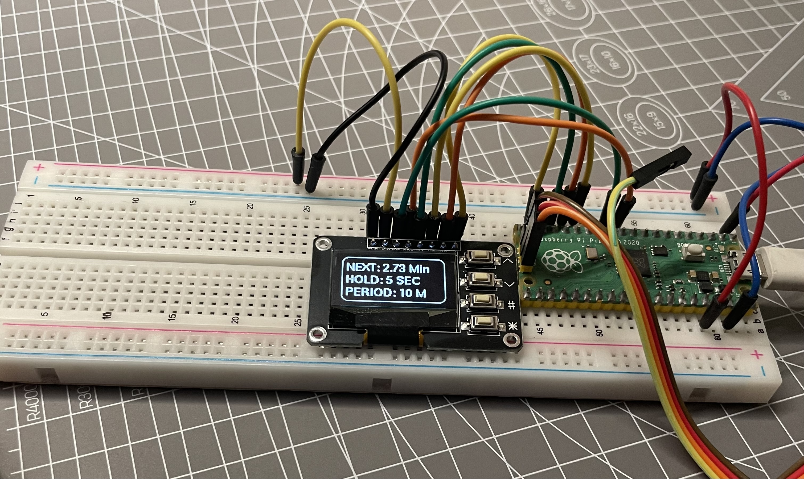
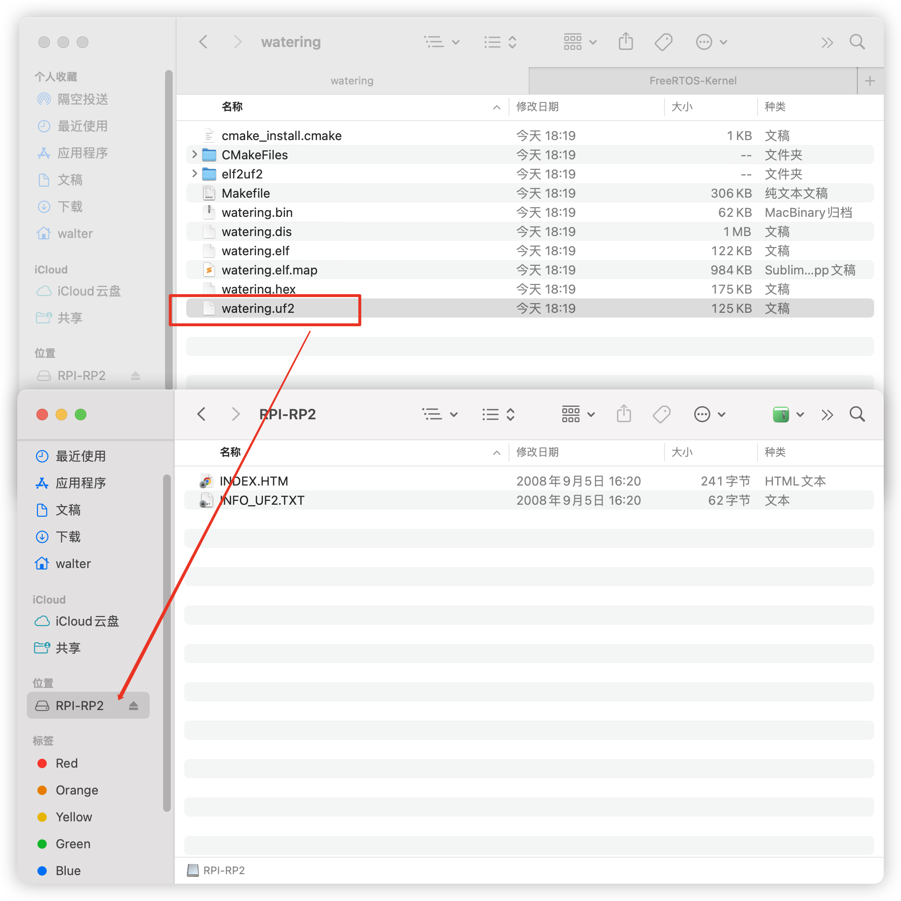

## 说明
这是一个基于raspberrypi pico的自动浇水工具,支持设置浇水周期与时长;



## 演示

## 引脚定义
LED：SSD1306 128x64

MCU：RP2040

GP8   --------------- I2C0(SDA)

GP9   --------------- I2C0(SCK)

GP14  --------------- (UP_KEY)

GP11  --------------- (OK_KEY)

GP13  --------------- (DOWN_KEY)

GP12  --------------- (CANCEL_KEY)

GP10  --------------- (PUMP OUT)

## 编译

**安装编译依赖**

参考：https://github.com/raspberrypi/pico-sdk

**编译**

```shell
mkdir build
cd build
cmake ..
make
```

## 烧录

将watering.uf2拷贝到PICO挂载的磁盘中（如下图）

